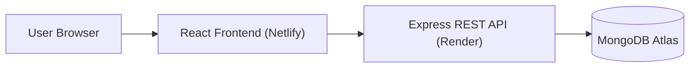
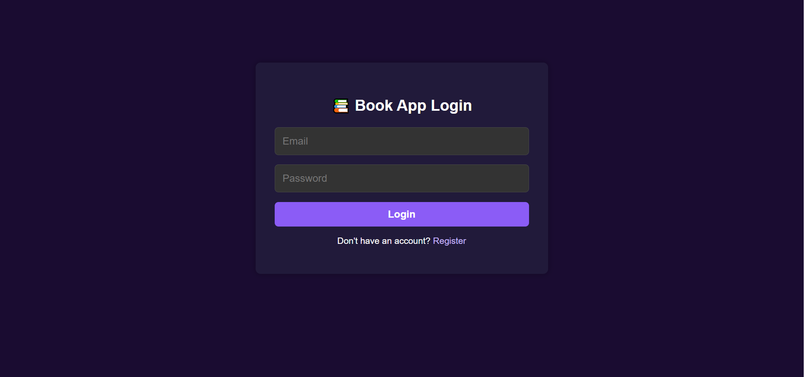
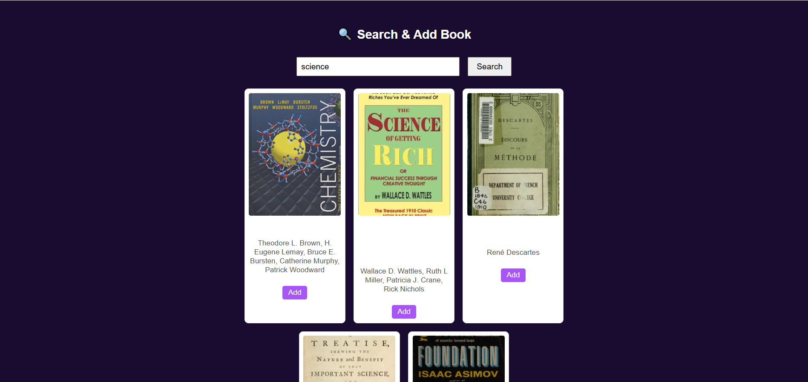

# 📚 Book Barter System

> A **production-deployed MERN stack** peer-to-peer book exchange platform where readers can list books, discover titles, and request swaps through a secure **REST API** with **JWT authentication**.

[](https://bookbartersystem.netlify.app)

## 🛡️ Tech & Deployment Badges


---

## ❗ Problem Statement

Books can be expensive for students and everyday readers, especially when titles are only needed temporarily. The **Book Barter System** solves this by enabling direct community-driven exchanges so users can trade books instead of buying new copies. This approach lowers cost, increases access to reading, and reduces waste through reusability.

---

## ✨ Features

- 🔐 Secure user registration and login with **JWT authentication** + bcrypt password hashing
- 📘 Book listing workflow with add + retrieval endpoints and owner-scoped views
- 🔄 Barter request system to propose and respond to book trades
- 🔎 Search experience for discovering books by title/author from listed inventory
- 🧭 User-focused dashboard flows for managing books and trade activity
- 📱 Responsive, modern React UI suitable for desktop and mobile usage
- ❤️ Health and root status endpoints for uptime monitoring (BetterStack-friendly)

---

## 🧱 Tech Stack

| Layer | Technology | Purpose |
|---|---|---|
| Frontend | React (Vite), React Router, Axios | UI rendering, route protection, API communication |
| Backend | Node.js, Express.js | REST API, business logic, auth-protected routes |
| Database | MongoDB Atlas + Mongoose | Persistent storage for users, books, and trades |
| Authentication | JWT + bcrypt | Token-based auth and secure password hashing |
| Deployment | Netlify (client), Render (server) | Cloud hosting for full stack app |
| Monitoring | BetterStack | Uptime monitoring and incident alerts |

---

## 🏗️ Architecture Overview



---

## 🌐 Live Demo

🔗 **Frontend (Production):** https://bookbartersystem.netlify.app  
🔗 **Backend API (Production):** https://book-barter-system.onrender.com

### Quick walkthrough (under 1 minute)
1. Open the live app and create an account (or log in).
2. Browse listed books from other users.
3. Search for a title/author you want.
4. Add one of your own books to your exchange inventory.
5. Initiate or respond to a trade request.

---

## 🖼️ Screenshots

> Replace these placeholders with actual screenshots from your deployed app.

- `docs/screenshots/login.png` — Login / Signup screen
- `docs/screenshots/book-list.png` — Book listing / search page
- `docs/screenshots/trade-request.png` — Trade request / response flow

Example markdown:

```md



```

---

## 🔌 API Endpoints (Current)

> Base URL: `https://book-barter-system.onrender.com`

| Method | Endpoint | Description | Auth Required |
|---|---|---|---|
| POST | `/api/auth/register` | Register a new user | ❌ |
| POST | `/api/auth/login` | Authenticate user and return JWT | ❌ |
| GET | `/api/books` | Get all available books (supports search query) | ❌ |
| POST | `/api/books/add` | Add a new book listing | ✅ |
| GET | `/api/books/mine` | Get current user's listed books | ✅ |
| GET | `/api/books/:id` | Get single book details | ❌ |
| POST | `/api/trades/request` | Create trade request | ✅ |
| POST | `/api/trades/respond` | Accept/reject trade request | ✅ |
| GET | `/api/trades` | Get trades where user is requester/owner | ✅ |
| GET | `/api/users/me` | Get current authenticated user profile | ✅ |
| GET | `/health` | Health check endpoint for monitors | ❌ |
| GET | `/` | Root status/info endpoint | ❌ |

---

## 🚀 Getting Started (Local Development)

This repository uses two apps:
- `client/` → React frontend
- `server/` → Node/Express backend

### 1) Clone the repository

```bash
git clone <your-repo-url>
cd Book-Barter-System
```

### 2) Backend setup (`server/`)

```bash
cd server
npm install
```

Create `.env` in `server/`:

```env
MONGO_URI=your_mongodb_atlas_connection_string
JWT_SECRET=your_secure_jwt_secret
PORT=3030
FRONTEND_URL=http://localhost:5173,https://bookbartersystem.netlify.app
```

Run backend:

```bash
npm start
```

### 3) Frontend setup (`client/`)

```bash
cd ../client
npm install
```

Create `.env` in `client/`:

```env
VITE_API_BASE_URL=http://localhost:3030
```

Run frontend:

```bash
npm run dev
```

App will typically be available at: `http://localhost:5173`

---

## 🔐 Environment Variables

### Backend (`server/.env`)

| Variable | Required | Purpose |
|---|---|---|
| `MONGO_URI` | ✅ | MongoDB Atlas connection string |
| `JWT_SECRET` | ✅ | Secret key used to sign JWTs |
| `PORT` | ✅ | API server port (default: 3030) |
| `FRONTEND_URL` | ✅ (recommended) | Comma-separated CORS allowlist origins |

### Frontend (`client/.env`)

| Variable | Required | Purpose |
|---|---|---|
| `VITE_API_BASE_URL` | ✅ | Base URL of deployed/local backend API |

---

## ☁️ Deployment

The application is fully cloud deployed in a production-style setup:

- **Frontend:** Netlify (React app)
- **Backend:** Render (Express REST API)
- **Database:** MongoDB Atlas
- **Monitoring:** BetterStack HTTP monitoring (`/health`) to track uptime and availability

This demonstrates real-world **cloud deployment** for a **full stack developer** workflow with separate frontend/backend services and managed database infrastructure.

---

## 📚 What I Learned

- Built and consumed a custom **REST API** in a complete **MERN stack** workflow.
- Implemented **JWT authentication** end-to-end (register → login → protected API routes).
- Managed CORS and environment-specific configuration across independent client/server deployments.
- Deployed and operated a multi-service app in production-like conditions using Netlify, Render, MongoDB Atlas, and BetterStack.

---

## 🤝 Connect / Contact

- **GitHub:** https://github.com/<your-github-username>
- **LinkedIn:** https://www.linkedin.com/in/<your-linkedin-username>

---

## 📄 License

This project is licensed under the MIT License. See [LICENSE](LICENSE) for details.
